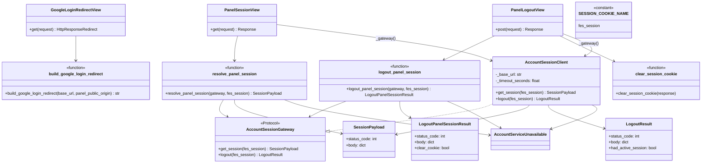
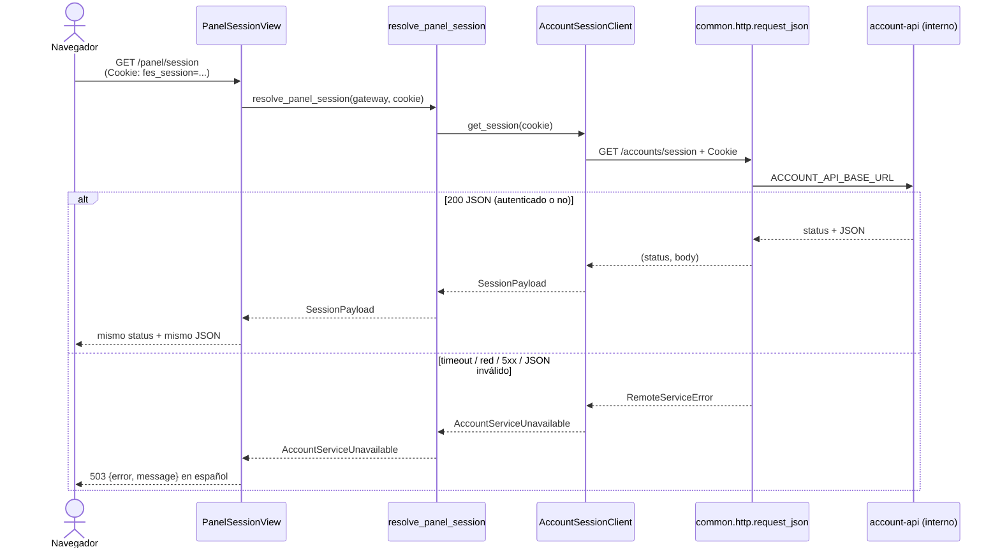

# UML 001 — Login del panel con la sesión de cuentas

Diagramas alineados con el código real en `src/` de la rama
`001/feat-panel-session-login`. Prosa en español; diagramas en Mermaid.

## 1. Contexto

`panel-api` no es dueño de la identidad ni de Google. Expone tres endpoints bajo
`/panel/...` que redirigen al login público de cuentas, consultan la sesión
compartida y solicitan el logout. La cookie `fes_session` la emite
`account-api`; el panel solo la reenvía y, al salir, la borra en la respuesta
HTTP al navegador.

Layout real (sin módulo `shops`):

```text
src/
├── config/                 # settings, urls, wsgi
├── common/
│   ├── health/views.py     # GET /health/live, /health/ready
│   ├── panel/views.py      # GET /panel
│   └── http.py             # request_json / RemoteServiceError
└── identity/
    ├── api/                # vistas DRF, urls, clear_session_cookie
    ├── application/        # casos de uso, puerto, DTOs
    ├── domain/             # constantes y errores
    └── infrastructure/     # AccountSessionClient
```

Dos bases URL distintas:

| Variable | Uso |
|---|---|
| `ACCOUNTS_PUBLIC_BASE_URL` | Redirect del navegador a `/accounts/login/google` |
| `ACCOUNT_API_BASE_URL` | Proxy servidor → `/accounts/session` y `/accounts/logout` |
| `PANEL_PUBLIC_ORIGIN` | `return_to` del login y único origen CORS |

## 2. Diagrama de componentes

```mermaid
flowchart TB
  subgraph browser [Navegador / panel-web]
    UI[Cliente SPA]
  end

  subgraph panelApi [panel-api]
    subgraph configLayer [config]
      Urls[config.urls]
      Settings[config.settings]
    end

    subgraph commonLayer [common]
      PanelView[common.panel.views.panel]
      HealthLive[common.health.views.live]
      HealthReady[common.health.views.ready]
      HttpHelper[common.http.request_json]
    end

    subgraph identityApp [identity]
      ApiViews[api.views]
      Cookies[api.cookies.clear_session_cookie]
      BuildRedirect[application.build_google_login_redirect]
      ResolveSession[application.resolve_panel_session]
      LogoutSession[application.logout_panel_session]
      Gateway[[AccountSessionGateway Protocol]]
      Client[infrastructure.AccountSessionClient]
      Domain[domain: SESSION_COOKIE_NAME / AccountServiceUnavailable]
    end
  end

  subgraph accounts [account-api]
    PublicLogin["GET /accounts/login/google"]
    SessionEndpoint["GET /accounts/session"]
    LogoutEndpoint["POST /accounts/logout"]
  end

  UI -->|GET /panel/login/google| ApiViews
  UI -->|GET /panel/session| ApiViews
  UI -->|POST /panel/logout| ApiViews
  UI -->|GET /panel| PanelView
  UI -->|health| HealthLive
  UI --> HealthReady

  Urls --> ApiViews
  Urls --> PanelView
  Urls --> HealthLive
  Urls --> HealthReady

  ApiViews --> BuildRedirect
  ApiViews --> ResolveSession
  ApiViews --> LogoutSession
  ApiViews --> Cookies
  ApiViews --> Client
  ResolveSession --> Gateway
  LogoutSession --> Gateway
  Client -.implementa.-> Gateway
  Client --> HttpHelper
  Client --> Domain
  Settings --> ApiViews
  Settings --> Client

  BuildRedirect -->|ACCOUNTS_PUBLIC_BASE_URL + return_to| PublicLogin
  Client -->|ACCOUNT_API_BASE_URL| SessionEndpoint
  Client -->|ACCOUNT_API_BASE_URL| LogoutEndpoint
```



## 3. Diagrama de clases (identity)



## 4. Secuencia — login redirect (RF-1, RF-8, RF-11)

El navegador sigue el 302 hacia la URL **pública** de cuentas. No hay llamada
servidor→servidor en este paso.

```mermaid
sequenceDiagram
  actor Browser as Navegador
  participant View as GoogleLoginRedirectView
  participant UC as build_google_login_redirect
  participant Settings as settings
  participant Accounts as account-api (público)

  Browser->>View: GET /panel/login/google
  View->>Settings: ACCOUNTS_PUBLIC_BASE_URL<br/>PANEL_PUBLIC_ORIGIN
  View->>UC: build_google_login_redirect(public_base, origin)
  UC-->>View: {public_base}/accounts/login/google?return_to={origin}
  View-->>Browser: 302 Location = URL pública
  Browser->>Accounts: GET /accounts/login/google?return_to=...
  Note over Accounts: OAuth Google; emite cookie fes_session<br/>y redirige de vuelta al panel
```

## 5. Secuencia — session proxy (RF-2, RF-3, RF-12, RF-14)



## 6. Secuencia — logout (RF-4, RF-5, RF-13, RF-15)

Comportamiento real del código:

1. `logout_panel_session` llama al gateway; si no hay excepción, **siempre**
   marca `clear_cookie=True` (el panel borra la cookie en la respuesta).
2. La vista **proxy** del `status_code` y el `body` que devolvió cuentas.
3. `common.http.request_json` trata cuerpo vacío como `{}` (p. ej. si
   account-api responde **204 No Content** sin JSON).
4. Ante `AccountServiceUnavailable`: 503 en español y **no** se borra la cookie.

Los tests de integración suelen mockear cuentas con `200` +
`{"authenticated": false}`; eso no obliga al contrato de producción, donde
account-api puede devolver 204 vacío.

```mermaid
sequenceDiagram
  actor Browser as Navegador
  participant View as PanelLogoutView
  participant UC as logout_panel_session
  participant Client as AccountSessionClient
  participant Cookie as clear_session_cookie
  participant Accounts as account-api (interno)

  Browser->>View: POST /panel/logout<br/>(Cookie opcional)
  View->>UC: logout_panel_session(gateway, cookie)
  UC->>Client: logout(cookie)
  Client->>Accounts: POST /accounts/logout + Cookie
  alt éxito (p. ej. 204 vacío o 200 JSON)
    Accounts-->>Client: status + cuerpo (vacío → {})
    Client-->>UC: LogoutResult
    UC-->>View: clear_cookie=True + status/body proxy
    View->>Cookie: clear_session_cookie(response)
    Note over Cookie: Path=/; HttpOnly; SameSite=Lax;<br/>Domain=SESSION_COOKIE_DOMAIN;<br/>Secure=getattr(SESSION_COOKIE_SECURE, False)
    View-->>Browser: status/body de cuentas + Set-Cookie borrada
  else fallo de cuentas
    Client-->>UC: AccountServiceUnavailable
    UC-->>View: excepción
    View-->>Browser: 503 sin borrar fes_session
  end
```

## 7. Cookie Secure

`clear_session_cookie` usa
`secure=bool(getattr(settings, "SESSION_COOKIE_SECURE", False))`.
`config.settings` **no** define `SESSION_COOKIE_SECURE` hoy; el getattr cae en
`False` salvo que el entorno/settings de prueba lo inyecten.
