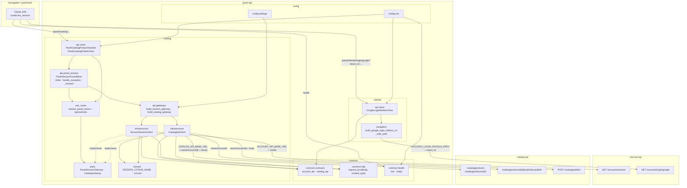
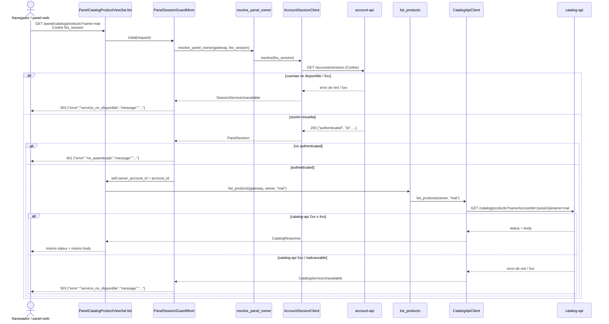
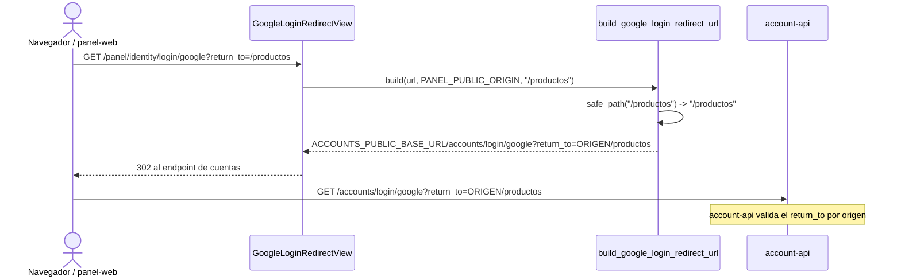

# UML 002 — Frontera de catálogo: drafts, publicación y sesión

Diagramas **as-built**, alineados con `plan.md`/`tasks.md` y con las convenciones
de `panel-api` (`src/` para código, `tests/` para pruebas). Prosa en español;
diagramas en Mermaid.

## 1. Contexto

`panel-api` no es dueño de los productos. Expone `/panel/catalog/...` como
frontera: resuelve la cookie `fes_session` contra `account-api` y, con una sesión
autenticada, reenvía cada operación a `catalog-api` propagando la cuenta dueña
como `ownerAccountId`. La frontera no persiste productos, etapas, dueños ni
imágenes, y no valida campos de dominio del producto. Además, el redirect de
login arma un `return_to` de origen + ruta relativa segura para volver a la
página actual.

Layout as-built (módulo `catalog`, sin `shops`):

```text
src/
├── common/
│   ├── contracts/
│   │   ├── account_api.py      # /accounts/session + claves de sesión
│   │   └── catalog_api.py      # /catalog/..., ownerAccountId y name
│   ├── health/views.py         # /health/live, /health/ready
│   ├── http.py                 # request_json + body/content_type
│   └── json_types.py           # JsonBody (dict | list)
├── identity/
│   ├── navigation/google_login_redirect.py  # return_to relativo seguro
│   └── api/views/google_login_redirect.py   # lee return_to
└── catalog/
    ├── api/
    │   ├── gateways.py         # factories desde settings
    │   ├── panel_session.py    # PanelSessionGuardMixin + _forward
    │   ├── urls.py
    │   └── views/              # PanelCatalogProductViewSet · PanelCatalogPublishView
    ├── use_cases/              # una función por operación
    ├── ports/                  # PanelSessionGateway, CatalogGateway
    ├── dtos/                   # PanelSession, CatalogResponse
    ├── domain/                 # constantes y domain/errors/
    └── infrastructure/         # AccountSessionClient, CatalogApiClient
```

Variables de entorno relevantes:

| Variable | Uso |
|---|---|
| `ACCOUNT_API_BASE_URL` | Resolver `fes_session` (`GET /accounts/session`) |
| `CATALOG_API_BASE_URL` | Reenviar las operaciones a `catalog-api` |
| `CATALOG_API_TIMEOUT_SECONDS` | Timeout del cliente de catálogo |
| `PANEL_PUBLIC_ORIGIN` | Origen CORS con credenciales y base del `return_to` |
| `ACCOUNTS_PUBLIC_BASE_URL` | Base pública de cuentas para el redirect de login |

## 2. Diagrama de componentes



## 3. Diagrama de clases (catalog)

Se muestran relaciones arquitectónicas relevantes; no se reproduce cada import.
Los DTOs y errores se citan cuando son contratos de frontera.

```mermaid
classDiagram
  direction TB

  class PanelCatalogProductViewSet {
    +list(request) Response
    +create(request) Response
    +update(request, product_id) Response
    +destroy(request, product_id) Response
    +publish(request, product_id) Response
    +unpublish(request, product_id) Response
  }
  class PanelCatalogPublishView {
    +post(request) Response
  }
  class PanelSessionGuardMixin {
    +owner_account_id: str
    +_session_gateway() AccountSessionClient
    +_catalog_gateway() CatalogApiClient
    +initial(request, ...) None
    +handle_exception(exc) Response
    +_forward(operation) Response
  }

  class resolve_panel_owner {
    <<function>>
    +resolve_panel_owner(gateway, fes_session) PanelSession
  }
  class list_products {
    <<function>>
    +list_products(gateway, owner, name=None) CatalogResponse
  }
  class create_product {
    <<function>>
    +create_product(gateway, owner, body, content_type) CatalogResponse
  }
  class update_product {
    <<function>>
    +update_product(gateway, owner, product_id, body, content_type) CatalogResponse
  }
  class delete_product {
    <<function>>
    +delete_product(gateway, owner, product_id) CatalogResponse
  }
  class publish_product {
    <<function>>
    +publish_product(gateway, owner, product_id) CatalogResponse
  }
  class unpublish_product {
    <<function>>
    +unpublish_product(gateway, owner, product_id) CatalogResponse
  }
  class publish_catalog {
    <<function>>
    +publish_catalog(gateway, owner, body, content_type) CatalogResponse
  }

  class PanelSessionGateway {
    <<Protocol>>
    +resolve(fes_session) PanelSession
  }
  class CatalogGateway {
    <<Protocol>>
    +list_products(owner, name=None) CatalogResponse
    +create_product(owner, body, content_type) CatalogResponse
    +update_product(owner, product_id, body, content_type) CatalogResponse
    +delete_product(owner, product_id) CatalogResponse
    +publish_product(owner, product_id) CatalogResponse
    +unpublish_product(owner, product_id) CatalogResponse
    +publish_catalog(owner, body, content_type) CatalogResponse
  }

  class AccountSessionClient {
    -_base_url: str
    -_timeout_seconds: float
    +resolve(fes_session) PanelSession
  }
  class CatalogApiClient {
    -_base_url: str
    -_timeout_seconds: float
    +list_products(owner, name=None) CatalogResponse
    +create_product(owner, body, content_type) CatalogResponse
    +update_product(owner, product_id, body, content_type) CatalogResponse
    +delete_product(owner, product_id) CatalogResponse
    +publish_product(owner, product_id) CatalogResponse
    +unpublish_product(owner, product_id) CatalogResponse
    +publish_catalog(owner, body, content_type) CatalogResponse
    -_with_query(path, owner, name) str
  }

  class PanelSession {
    +authenticated: bool
    +account_id: str
  }
  class CatalogResponse {
    +status_code: int
    +body: JsonBody
  }
  class SessionServiceUnavailable
  class CatalogServiceUnavailable
  class SESSION_COOKIE_NAME {
    <<constant>>
    fes_session
  }

  PanelCatalogProductViewSet --> PanelSessionGuardMixin
  PanelCatalogPublishView --> PanelSessionGuardMixin
  PanelSessionGuardMixin --> resolve_panel_owner
  PanelSessionGuardMixin --> AccountSessionClient : _session_gateway()
  PanelSessionGuardMixin --> CatalogApiClient : _catalog_gateway()
  PanelSessionGuardMixin --> SESSION_COOKIE_NAME
  PanelCatalogProductViewSet --> list_products
  PanelCatalogProductViewSet --> create_product
  PanelCatalogProductViewSet --> update_product
  PanelCatalogProductViewSet --> delete_product
  PanelCatalogProductViewSet --> publish_product
  PanelCatalogProductViewSet --> unpublish_product
  PanelCatalogPublishView --> publish_catalog

  resolve_panel_owner --> PanelSessionGateway
  resolve_panel_owner --> SessionServiceUnavailable
  list_products --> CatalogGateway
  create_product --> CatalogGateway
  update_product --> CatalogGateway
  delete_product --> CatalogGateway
  publish_product --> CatalogGateway
  unpublish_product --> CatalogGateway
  publish_catalog --> CatalogGateway

  AccountSessionClient ..|> PanelSessionGateway
  CatalogApiClient ..|> CatalogGateway
  AccountSessionClient --> SessionServiceUnavailable
  CatalogApiClient --> CatalogServiceUnavailable
  AccountSessionClient ..> PanelSession
  CatalogApiClient ..> CatalogResponse
```



## 4. Secuencia — listar productos con filtro

Flujo principal: resolver la sesión, fijar el dueño y reenviar; el `name`
opcional viaja como query param y el filtrado lo hace `catalog-api`. Cubre el 401
sin sesión y el 503 si cuentas cae.



Notas de contrato:

- `name` se añade a la query solo cuando viene con valor; el panel no filtra ni
  normaliza. **(RF-23)**
- `ownerAccountId` viaja como **query param autoritativo** en todas las llamadas
  internas; el valor que envíe el cliente en el cuerpo se ignora. **(RF-4, RF-17)**

## 5. Secuencia — crear/actualizar producto multipart

El punto delicado es preservar el `Content-Type` completo (con `boundary`); usar
`request.content_type` lo perdía y `catalog-api` devolvía 415.

```mermaid
sequenceDiagram
  actor Browser as Navegador / panel-web
  participant View as PanelCatalogProductViewSet.create/update
  participant Guard as PanelSessionGuardMixin
  participant UC as create_product / update_product
  participant CatalogClient as CatalogApiClient
  participant Catalog as catalog-api

  Browser->>View: POST/PUT /panel/catalog/products[/{id}]<br/>Cookie fes_session<br/>Content-Type: multipart/form-data; boundary=xyz<br/>body binario
  View->>Guard: initial(request)
  Note over Guard: 401 sin sesión; 503 si cuentas falla<br/>(mismo flujo de la sección 4)
  Guard-->>View: self.owner_account_id = account_id
  View->>UC: create_product(gateway, owner, request.body, request.META["CONTENT_TYPE"])
  UC->>CatalogClient: create_product(owner, body, "multipart/form-data; boundary=xyz")
  CatalogClient->>Catalog: POST /catalog/products?ownerAccountId={sesión}<br/>body tal cual<br/>Content-Type: multipart/form-data; boundary=xyz
  alt catalog-api 2xx o 4xx
    Catalog-->>CatalogClient: status + body
    CatalogClient-->>View: CatalogResponse
    View-->>Browser: mismo status + mismo body
  else catalog-api 5xx / inalcanzable
    Catalog-->>CatalogClient: error de red / 5xx
    CatalogClient-->>Guard: CatalogServiceUnavailable
    Guard-->>Browser: 503 {"error":"servicio_no_disponible","message":"..."}
  end
```

Notas de contrato:

- Se usa `request.META["CONTENT_TYPE"]` (no `request.content_type`) para
  conservar el `boundary`; sin él, `catalog-api` no puede parsear el multipart y
  responde 415. **(RF-24)**
- `common.http` propaga `body`/`content_type` sin interpretarlos. **(RF-18, RF-24)**

## 6. Secuencia — publicar catálogo

```mermaid
sequenceDiagram
  actor Browser as Navegador / panel-web
  participant View as PanelCatalogPublishView
  participant Guard as PanelSessionGuardMixin
  participant UC as publish_catalog
  participant CatalogClient as CatalogApiClient
  participant Catalog as catalog-api

  Browser->>View: POST /panel/catalog/publish<br/>Cookie fes_session; body: productos sin dueño visibles<br/>(o sin body, Content-Type text/plain desde Angular)
  View->>Guard: initial(request)
  Note over Guard: 401 sin sesión; 503 si cuentas falla<br/>(mismo flujo de la sección 4)
  Guard-->>View: self.owner_account_id = account_id
  View->>View: body = request.body or b"{}"; content_type = "application/json"
  View->>UC: publish_catalog(gateway, owner, body, "application/json")
  UC->>CatalogClient: publish_catalog(owner, body, "application/json")
  CatalogClient->>Catalog: POST /catalog/publish?ownerAccountId={sesión}<br/>body JSON ({} si no vino cuerpo)<br/>Content-Type: application/json
  alt hay productos (sin dueño + draft del dueño)
    Catalog-->>CatalogClient: 200 {"published": n}
    CatalogClient-->>View: CatalogResponse
    View-->>Browser: 200 con n publicados
  else no hay productos por publicar
    Catalog-->>CatalogClient: 200 {"published": 0}
    CatalogClient-->>View: CatalogResponse
    View-->>Browser: 200 con 0 publicados (no es error)
  end
```

Notas de contrato:

- Si no viene cuerpo, se reenvía `{}` como `application/json`; así el
  `text/plain` del cliente Angular no provoca un 415. **(RF-25)**
- Publicar sin productos responde 200 con 0 publicados; lo decide
  `catalog-api`. **(RF-21)**

## 7. Secuencia — retorno de login



Nota: si `return_to` falta, no empieza con `/` o empieza con `//`, `_safe_path`
devuelve cadena vacía y el `return_to` queda reducido a `PANEL_PUBLIC_ORIGIN`.
La validación por origen vive en `account-api`. **(RF-26, RF-27)**

## 8. Traducción de errores

| Origen | Estado y cuerpo de la frontera | RF |
|---|---|---|
| Sin cookie / sesión no autenticada | `401` `{"error":"no_autenticado","message":"..."}` | RF-3 |
| `account-api` inalcanzable o 5xx | `503` `{"error":"servicio_no_disponible","message":"..."}` sin reenvío | RF-14 |
| `catalog-api` 4xx | mismo estado y cuerpo de `catalog-api` | RF-22 |
| `catalog-api` 5xx o inalcanzable | `503` `{"error":"servicio_no_disponible","message":"..."}` | RF-15 |
| Sin productos en `publish` | `200` con 0 publicados | RF-21 |
| Multipart sin `boundary` (regresión) | evitado con `request.META["CONTENT_TYPE"]` | RF-24 |
| `publish` sin cuerpo / `text/plain` (regresión) | evitado enviando `{}` como `application/json` | RF-25 |
