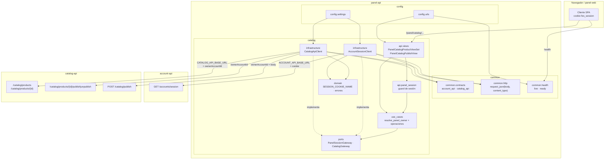

# UML 002 — Frontera de catálogo: drafts, publicación y sesión

Diagramas alineados con `plan.md`/`tasks.md` y con las convenciones de
`panel-api` (`src/` para código, `tests/` para pruebas). Prosa en español;
diagramas en Mermaid.

## 1. Contexto

`panel-api` no es dueño de los productos. Expone `/panel/catalog/...` como
frontera: resuelve la cookie `fes_session` contra `account-api` y, con una sesión
autenticada, reenvía cada operación a `catalog-api` propagando la cuenta dueña
como `ownerAccountId`. La frontera no persiste productos, etapas, dueños ni
imágenes, y no valida campos de dominio del producto.

Layout objetivo (nuevo módulo `catalog`, sin `shops`):

```text
src/
├── common/
│   ├── contracts/
│   │   ├── account_api.py      # /accounts/session
│   │   └── catalog_api.py      # /catalog/... y ownerAccountId
│   ├── health/views.py         # /health/live, /health/ready
│   └── http.py                 # request_json + body/content_type
└── catalog/
    ├── api/                    # guard de sesión, urls y views
    ├── use_cases/              # una función por operación
    ├── ports/                  # PanelSessionGateway, CatalogGateway
    ├── dtos/                   # PanelSession, CatalogResponse
    ├── domain/                 # constantes y domain/errors/
    └── infrastructure/         # AccountSessionClient, CatalogApiClient
```

Variables de entorno relevantes:

| Variable | Uso |
|---|---|
| `ACCOUNT_API_BASE_URL` | Resolver `fes_session` (`GET /accounts/session`) |
| `CATALOG_API_BASE_URL` | Reenviar las operaciones a `catalog-api` |
| `CATALOG_API_TIMEOUT_SECONDS` | Timeout del cliente de catálogo |
| `PANEL_PUBLIC_ORIGIN` | Único origen CORS con credenciales |

## 2. Diagrama de componentes



## 3. Diagrama de clases (catalog)

Se muestran relaciones arquitectónicas relevantes; no se reproduce cada import.
Los DTOs y errores se citan cuando son contratos de frontera.

```mermaid
classDiagram
  direction TB

  class PanelCatalogProductViewSet {
    +list(request) Response
    +create(request) Response
    +update(request, product_id) Response
    +destroy(request, product_id) Response
    +publish(request, product_id) Response
    +unpublish(request, product_id) Response
  }
  class PanelCatalogPublishView {
    +post(request) Response
  }
  class panel_session_guard {
    <<dispatch>>
    +dispatch(request, ...) Response
  }

  class resolve_panel_owner {
    <<function>>
    +resolve_panel_owner(gateway, fes_session) PanelSession
  }
  class list_products {
    <<function>>
    +list_products(gateway, owner) CatalogResponse
  }
  class create_product {
    <<function>>
    +create_product(gateway, owner, body, content_type) CatalogResponse
  }
  class update_product {
    <<function>>
    +update_product(gateway, owner, product_id, body, content_type) CatalogResponse
  }
  class delete_product {
    <<function>>
    +delete_product(gateway, owner, product_id) CatalogResponse
  }
  class publish_product {
    <<function>>
    +publish_product(gateway, owner, product_id) CatalogResponse
  }
  class unpublish_product {
    <<function>>
    +unpublish_product(gateway, owner, product_id) CatalogResponse
  }
  class publish_catalog {
    <<function>>
    +publish_catalog(gateway, owner, body, content_type) CatalogResponse
  }

  class PanelSessionGateway {
    <<Protocol>>
    +resolve(fes_session) PanelSession
  }
  class CatalogGateway {
    <<Protocol>>
    +list_products(owner) CatalogResponse
    +create_product(owner, body, content_type) CatalogResponse
    +update_product(owner, product_id, body, content_type) CatalogResponse
    +delete_product(owner, product_id) CatalogResponse
    +publish_product(owner, product_id) CatalogResponse
    +unpublish_product(owner, product_id) CatalogResponse
    +publish_catalog(owner, body, content_type) CatalogResponse
  }

  class AccountSessionClient {
    -_base_url: str
    -_timeout_seconds: float
    +resolve(fes_session) PanelSession
  }
  class CatalogApiClient {
    -_base_url: str
    -_timeout_seconds: float
    +list_products(owner) CatalogResponse
    +create_product(owner, body, content_type) CatalogResponse
    +update_product(owner, product_id, body, content_type) CatalogResponse
    +delete_product(owner, product_id) CatalogResponse
    +publish_product(owner, product_id) CatalogResponse
    +unpublish_product(owner, product_id) CatalogResponse
    +publish_catalog(owner, body, content_type) CatalogResponse
  }

  class PanelSession {
    +authenticated: bool
    +account_id: str
  }
  class CatalogResponse {
    +status_code: int
    +body: dict
  }
  class SessionServiceUnavailable
  class CatalogServiceUnavailable
  class SESSION_COOKIE_NAME {
    <<constant>>
    fes_session
  }

  PanelCatalogProductViewSet --> panel_session_guard
  PanelCatalogPublishView --> panel_session_guard
  panel_session_guard --> resolve_panel_owner
  panel_session_guard --> AccountSessionClient : _session_gateway()
  panel_session_guard --> SESSION_COOKIE_NAME
  PanelCatalogProductViewSet --> list_products
  PanelCatalogProductViewSet --> create_product
  PanelCatalogProductViewSet --> update_product
  PanelCatalogProductViewSet --> delete_product
  PanelCatalogProductViewSet --> publish_product
  PanelCatalogProductViewSet --> unpublish_product
  PanelCatalogPublishView --> publish_catalog

  resolve_panel_owner --> PanelSessionGateway
  resolve_panel_owner --> SessionServiceUnavailable
  list_products --> CatalogGateway
  create_product --> CatalogGateway
  update_product --> CatalogGateway
  delete_product --> CatalogGateway
  publish_product --> CatalogGateway
  unpublish_product --> CatalogGateway
  publish_catalog --> CatalogGateway

  AccountSessionClient ..|> PanelSessionGateway
  CatalogApiClient ..|> CatalogGateway
  AccountSessionClient --> SessionServiceUnavailable
  CatalogApiClient --> CatalogServiceUnavailable
  AccountSessionClient ..> PanelSession
  CatalogApiClient ..> CatalogResponse
```



## 4. Secuencia — operación con sesión (crear/listar)

Flujo principal: resolver la sesión, fijar el dueño y reenviar. Cubre el 401 sin
sesión, el 503 si cuentas cae y la traducción de errores de catálogo.

```mermaid
sequenceDiagram
  actor Browser as Navegador / panel-web
  participant View as PanelCatalogProductViewSet<br/>(o PanelCatalogPublishView)
  participant Guard as panel_session_guard
  participant Session as resolve_panel_owner
  participant SessionClient as AccountSessionClient
  participant Accounts as account-api
  participant UC as use case (p. ej. create_product)
  participant CatalogClient as CatalogApiClient
  participant Catalog as catalog-api

  Browser->>View: POST /panel/catalog/products<br/>Cookie fes_session; body (JSON/multipart)
  View->>Guard: dispatch(request)
  Guard->>Session: resolve_panel_owner(gateway, fes_session)
  Session->>SessionClient: resolve(fes_session)
  SessionClient->>Accounts: GET /accounts/session (Cookie)
  alt cuentas no disponible / 5xx
    Accounts-->>SessionClient: error de red / 5xx
    SessionClient-->>Guard: SessionServiceUnavailable
    Guard-->>Browser: 503 {"error":"servicio_no_disponible","message":"..."}
  else sesión resuelta
    Accounts-->>SessionClient: 200 {"authenticated", "id", ...}
    SessionClient-->>Session: PanelSession
    Session-->>Guard: PanelSession
    alt no authenticated
      Guard-->>Browser: 401 {"error":"no_autenticado","message":"..."}
    else authenticated
      Guard->>View: self.owner_account_id = account_id
      View->>UC: create_product(gateway, owner, body, content_type)
      UC->>CatalogClient: create_product(owner, body, content_type)
      CatalogClient->>Catalog: POST /catalog/products?ownerAccountId={sesión}<br/>body reenviado tal cual
      alt catalog-api 2xx o 4xx
        Catalog-->>CatalogClient: status + body
        CatalogClient-->>UC: CatalogResponse
        UC-->>View: CatalogResponse
        View-->>Browser: mismo status + mismo body
      else catalog-api 5xx / inalcanzable
        Catalog-->>CatalogClient: error de red / 5xx
        CatalogClient-->>UC: CatalogServiceUnavailable
        UC-->>View: CatalogServiceUnavailable
        View-->>Browser: 503 {"error":"servicio_no_disponible","message":"..."}
      end
    end
  end
```

Notas de contrato:

- `ownerAccountId` viaja como **query param autoritativo** en todas las llamadas
  internas; el valor que envíe el cliente en el cuerpo se ignora. **(RF-4, RF-17)**
- `common.http` normaliza cuerpo vacío a `{}` y propaga `body`/`content_type`
  sin interpretarlos. **(RF-18)**

## 5. Secuencia — publicar catálogo

```mermaid
sequenceDiagram
  actor Browser as Navegador / panel-web
  participant View as PanelCatalogPublishView
  participant Guard as panel_session_guard
  participant UC as publish_catalog
  participant CatalogClient as CatalogApiClient
  participant Catalog as catalog-api

  Browser->>View: POST /panel/catalog/publish<br/>Cookie fes_session; body: productos sin dueño visibles
  View->>Guard: dispatch(request)
  Note over Guard: 401 sin sesión; 503 si cuentas falla<br/>(mismo flujo de la sección 4)
  Guard->>UC: publish_catalog(gateway, owner, body, content_type)
  UC->>CatalogClient: publish_catalog(owner, body, content_type)
  CatalogClient->>Catalog: POST /catalog/publish?ownerAccountId={sesión}<br/>body con los productos sin dueño
  alt hay productos (sin dueño + draft del dueño)
    Catalog-->>CatalogClient: 200 {"published": n}
    CatalogClient-->>View: CatalogResponse
    View-->>Browser: 200 con n publicados
  else no hay productos por publicar
    Catalog-->>CatalogClient: 200 {"published": 0}
    CatalogClient-->>View: CatalogResponse
    View-->>Browser: 200 con 0 publicados (no es error)
  end
```

## 6. Traducción de errores

| Origen | Estado y cuerpo de la frontera | RF |
|---|---|---|
| Sin cookie / sesión no autenticada | `401` `{"error":"no_autenticado","message":"..."}` | RF-3 |
| `account-api` inalcanzable o 5xx | `503` `{"error":"servicio_no_disponible","message":"..."}` sin reenvío | RF-14 |
| `catalog-api` 4xx | mismo estado y cuerpo de `catalog-api` | RF-22 |
| `catalog-api` 5xx o inalcanzable | `503` `{"error":"servicio_no_disponible","message":"..."}` | RF-15 |
| Sin productos en `publish` | `200` con 0 publicados | RF-21 |
