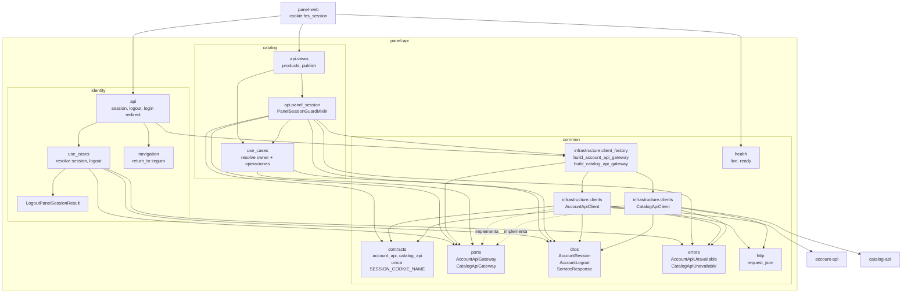
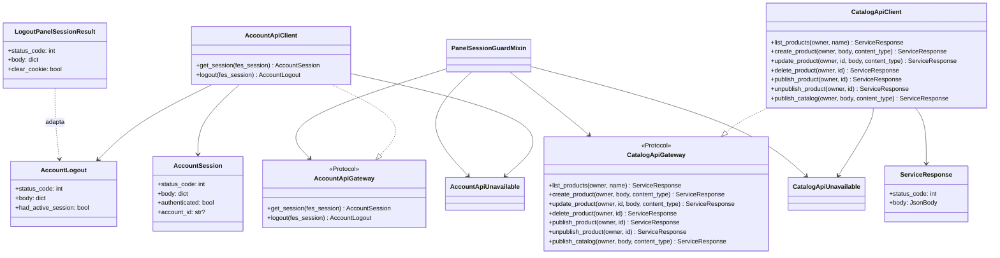
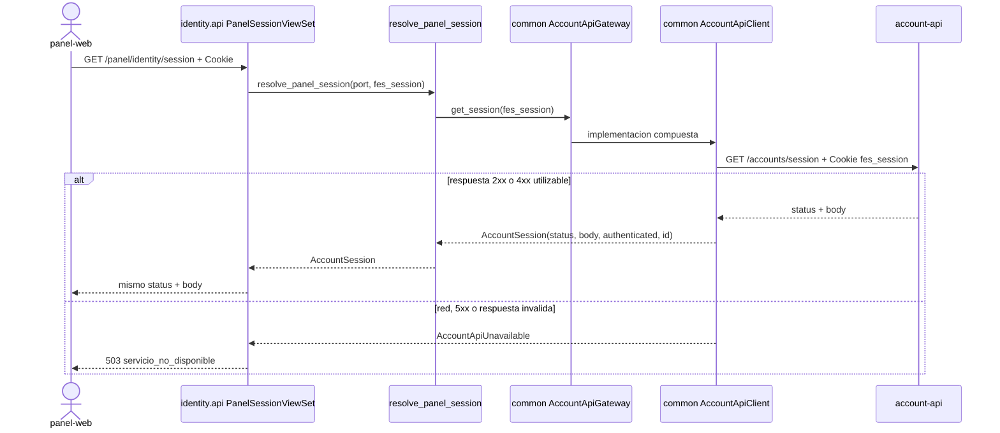
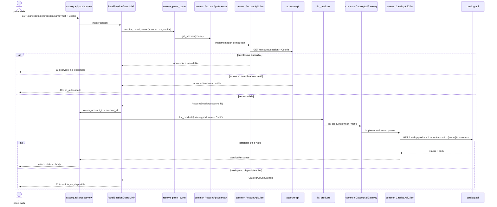

# UML 002 - Frontera de catalogo: drafts, publicacion y sesion

Diagramas **as-built**. Los clientes, puertos, DTOs, errores y contratos de
servicios externos pertenecen a `common`; identity y catalog contienen solo su
API, navegacion/casos de uso y DTOs estrictamente locales.

## 1. Layout

```text
src/
|-- common/
|   |-- contracts/               account_api.py, catalog_api.py
|   |-- dtos/                    AccountSession, AccountLogout, ServiceResponse
|   |-- errors/                  AccountApiUnavailable, CatalogApiUnavailable
|   |-- ports/                   AccountApiGateway, CatalogApiGateway
|   |-- infrastructure/clients/ AccountApiClient, CatalogApiClient
|   |-- http.py
|   |-- json_types.py
|   `-- health/
|-- identity/
|   |-- api/
|   |-- navigation/
|   |-- use_cases/
|   `-- dtos/                    LogoutPanelSessionResult
`-- catalog/
    |-- api/                     composition, guard, views y URLs
    `-- use_cases/
```

## 2. Componentes y dependencias



## 3. Clases y contratos comunes



## 4. Secuencia identity: consultar sesion



Logout usa el mismo cliente y puerto: `AccountApiClient.logout` devuelve
`AccountLogout`; el caso de uso lo adapta a `LogoutPanelSessionResult` para que
la API decida limpiar la cookie del panel.

## 5. Secuencia catalog: listar con filtro



## 6. Secuencia catalog: multipart y publish

```mermaid
sequenceDiagram
  actor Browser as panel-web
  participant View as catalog.api view
  participant UC as catalog use case
  participant Port as common CatalogApiGateway
  participant Client as common CatalogApiClient
  participant Catalog as catalog-api

  alt crear o actualizar producto
    Browser->>View: POST/PUT + multipart body + Content-Type con boundary
    Note over View: el guard ya fijo owner_account_id
    View->>UC: owner, request.body, META[CONTENT_TYPE]
    UC->>Port: create/update(owner, body, content_type)
    Port->>Client: implementacion compuesta
    Client->>Catalog: ownerAccountId query + body intacto + Content-Type intacto
  else publicar catalogo sin body
    Browser->>View: POST /panel/catalog/publish sin body
    View->>View: body = b"{}"; content_type = application/json
    View->>UC: publish_catalog(owner, body, content_type)
    UC->>Port: publish_catalog(owner, body, content_type)
    Port->>Client: implementacion compuesta
    Client->>Catalog: POST /catalog/publish?ownerAccountId={owner} + {}
  end
  Catalog-->>Client: status + body
  Client-->>View: ServiceResponse
  View-->>Browser: status + body
```

## 7. Restricciones verificadas

- `SESSION_COOKIE_NAME` vive unicamente en `common/contracts/account_api.py`.
- Ambos modulos usan fakes de `common.ports` en sus tests.
- Los tests de clientes viven en `tests/common`.
- La composicion concreta queda en las APIs; los casos de uso dependen de
  Protocols comunes.
- El contrato HTTP, health, CORS y ausencia de persistencia no cambiaron.
- `make verify`: verde, 112 tests, sin migraciones.
