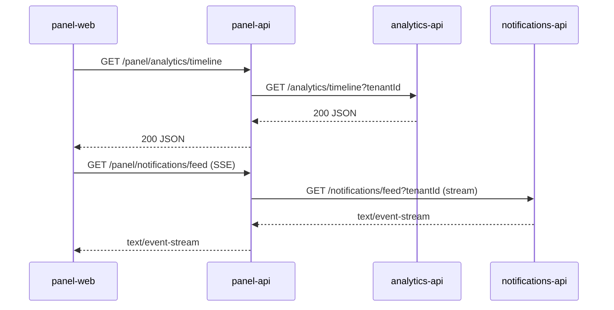
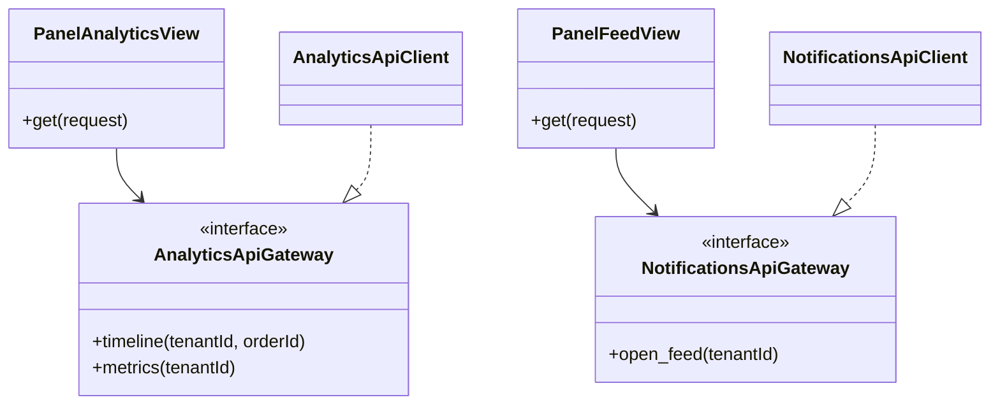

# UML 004 — Proxy del panel

## Flujo

```mermaid
sequenceDiagram
  participant Web as panel-web
  participant Panel as panel-api
  participant Analytics as analytics-api
  participant Notifications as notifications-api

  Web->>Panel: GET /panel/analytics/timeline
  Panel->>Analytics: GET /analytics/timeline?tenantId
  Analytics-->>Panel: 200 JSON
  Panel-->>Web: 200 JSON
  Web->>Panel: GET /panel/notifications/feed (SSE)
  Panel->>Notifications: GET /notifications/feed?tenantId (stream)
  Notifications-->>Panel: text/event-stream
  Panel-->>Web: text/event-stream
```

## Estructura

```mermaid
classDiagram
  class PanelAnalyticsView {
    +get(request)
  }
  class PanelFeedView {
    +get(request)
  }
  class AnalyticsApiGateway {
    <<interface>>
    +timeline(tenantId, orderId)
    +metrics(tenantId)
  }
  class NotificationsApiGateway {
    <<interface>>
    +open_feed(tenantId)
  }
  class AnalyticsApiClient
  class NotificationsApiClient

  PanelAnalyticsView --> AnalyticsApiGateway
  PanelFeedView --> NotificationsApiGateway
  AnalyticsApiClient ..|> AnalyticsApiGateway
  NotificationsApiClient ..|> NotificationsApiGateway
```
